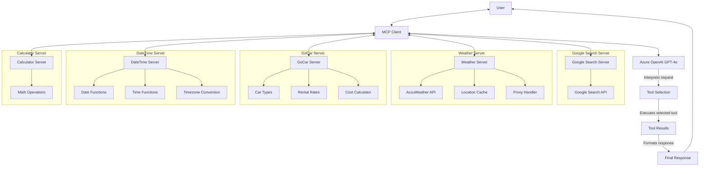
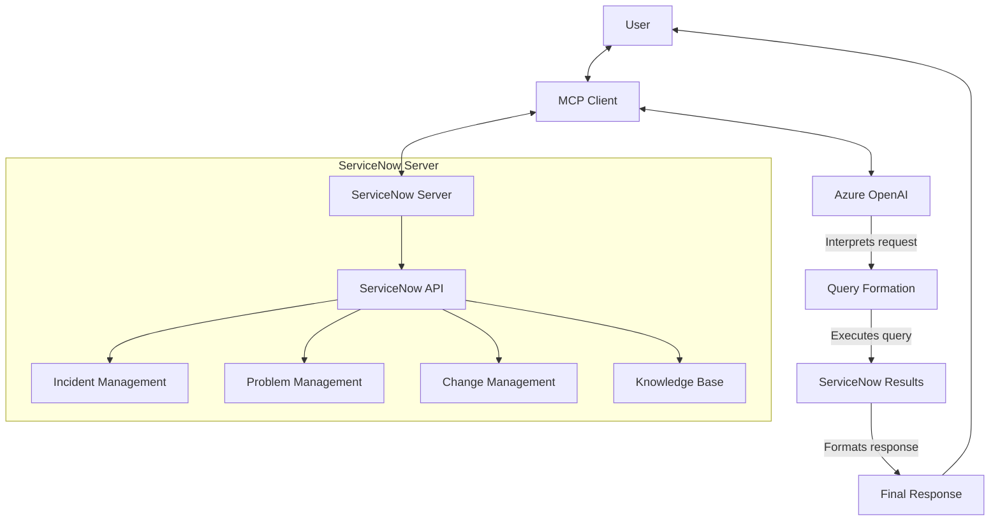

# Model Context Protocol (MCP) Implementation

This folder contains implementations of the Model Context Protocol (MCP), a standardized way for LLMs to interact with external tools and services. The MCP architecture enables seamless communication between language models and specialized servers that provide domain-specific functionality.

## Overview

The MCP implementation in this repository consists of:

1. **MCP Demo (`mcp_demo/`)**: A travel itinerary assistant that leverages multiple specialized servers
2. **MCP Test (`mcp_test/`)**: Sample implementations of basic MCP servers
3. **Snow MCP (`snow_mcp/`)**: ServiceNow integration using MCP architecture

## Architecture

### MCP Demo: Travel Itinerary Assistant

The Travel Itinerary MCP Agent consists of a central client that coordinates communication with multiple specialized servers, each providing specific functionality through well-defined tools.



### Snow MCP: ServiceNow Integration

The Snow MCP implementation connects to ServiceNow to retrieve and manage IT service management data.



## Available Servers and Tools

### MCP Demo Servers

1. **Google Search Server (`google_search_server.py`)**
   - `google_search`: Performs web searches using Google Search API

2. **Weather Server (`weather_server.py`)**
   - `get_current_weather`: Retrieves current weather conditions for a location
   - `get_forecast`: Obtains a 5 or 10-day weather forecast for a location

3. **GoCar Server (`gocar_server.py`)**
   - `get_car_types`: Lists all available car types and their details
   - `get_rate_by_car_type`: Returns detailed rate information for a specific car type
   - `calculate_rental_cost`: Calculates the total rental cost based on car type, duration, distance, and options

4. **DateTime Server (`datetime_server.py`)**
   - `get_current_date`: Returns the current date
   - `get_current_time`: Returns the current time
   - `get_current_datetime`: Returns the current date and time
   - `get_day_of_week`: Gets the day of the week for a date
   - `is_weekend`: Checks if a date is a weekend
   - `get_date_info`: Gets detailed information about a date
   - `convert_timezone`: Converts between timezones

5. **Calculator Server (`calculator_server.py`)**
   - `calculate`: Performs mathematical calculations

### Snow MCP Server

**ServiceNow Server (`snow_server.py`)**
- `search_knowledge`: Searches the ServiceNow knowledge base
- `get_incident`: Retrieves incident details
- `list_incidents`: Lists incidents matching criteria
- `create_incident`: Creates a new incident
- `update_incident`: Updates an existing incident

## Setup Instructions

### Prerequisites

- Python 3.10 or higher
- Azure OpenAI API access
- Required API keys (AccuWeather, Google Search, etc.)

### Installation

1. **Clone the repository and navigate to the MCP directory**:
   ```bash
   cd /path/to/GenAI-Cookbook-Intel-Azure/MCP
   ```

2. **Install the required packages**:
   ```bash
   pip install -r ../requirements.txt
   ```

3. **Set up environment variables** in a `.env` file in the root directory:
   ```
   OPENAI_API_KEY=your_openai_api_key
   OPENAI_API_HOST=your_azure_endpoint
   ACCUWEATHER_API_KEY=your_accuweather_api_key
   GOOGLE_API_KEY=your_google_api_key
   GOOGLE_SEARCH_ENGINE_ID=your_search_engine_id
   GOOGLE_CSE_ID=your_cse_id
   HTTP_PROXY=your_http_proxy  # if behind a corporate proxy
   HTTPS_PROXY=your_https_proxy  # if behind a corporate proxy
   NO_PROXY=domains_to_bypass_proxy  # if behind a corporate proxy

   # For Snow MCP
   SERVICENOW_INSTANCE_URL=your_servicenow_instance
   SERVICENOW_USERNAME=your_servicenow_username
   SERVICENOW_PASSWORD=your_servicenow_password
   ```

### Running the MCP Demo Travel Itinerary Agent

1. **Navigate to the MCP Demo directory**:
   ```bash
   cd mcp_demo
   ```

2. **Run the client**:
   ```bash
   python demo_client.py
   ```

   This will start the client and connect to all the required servers automatically.

3. **Enter your travel query when prompted**.

### Running the Snow MCP ServiceNow Assistant

1. **Navigate to the Snow MCP directory**:
   ```bash
   cd snow_mcp
   ```

2. **Run the server**:
   ```bash
   python snow_server.py
   ```

3. **In a separate terminal, run the client**:
   ```bash
   python client.py
   ```

4. **Enter your ServiceNow query when prompted**.

## Troubleshooting

- **Proxy Issues**: If you're behind a corporate firewall, ensure your HTTP_PROXY, HTTPS_PROXY, and NO_PROXY environment variables are correctly set.
- **API Key Errors**: Verify that all required API keys are correctly set in your .env file.
- **Server Connection Errors**: Make sure all server processes are running before starting the client.

## Contributing

Feel free to extend the MCP implementation with new servers and tools.

1. Create a new server file in the appropriate directory.
2. Implement the MCP protocol using the FastMCP or Server classes.
3. Register tools using the @mcp.tool() decorator or server.list_tools() method.
4. Add your server to the client configuration.

## Further Reading

- [MCP Demo Documentation](./mcp_demo/MCP_Agent_Demo.md): Detailed documentation of the Travel Itinerary Agent.
- [ServiceNow API Documentation](https://developer.servicenow.com/dev.do): For extending the Snow MCP implementation.
