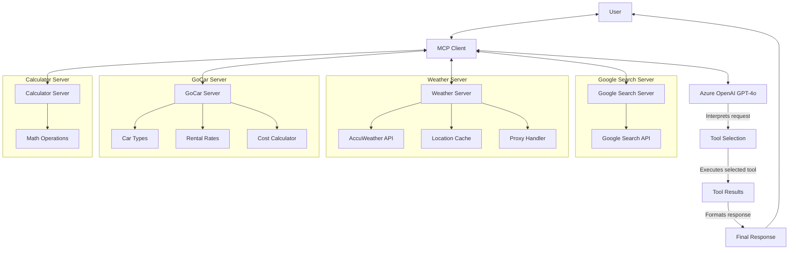

# Travel Itinerary MCP Agent

This document provides an overview of the Travel Itinerary MCP (Model Context Protocol) agent system, which assists users in planning trips by leveraging several specialized tools.

## Architecture Overview

The Travel Itinerary MCP Agent consists of a central client that coordinates communication with multiple specialized servers, each providing specific functionality through well-defined tools. The client uses Azure OpenAI's GPT-4o model to interpret user requests, decide which tools to use, and generate helpful responses.



## Components

### 1. MCP Client (`demo_client.py`)

The MCP client serves as the central coordinator for the entire system:

- Initializes the Azure OpenAI model (GPT-4o)
- Establishes connections to all MCP servers
- Provides a system prompt that guides the AI's behavior
- Creates a reactive agent using the LangGraph framework
- Manages the chat loop for ongoing user interaction
- Processes and formats the AI's responses

### 2. Google Search Server

Provides web search functionality:
- Allows the agent to search for travel destinations
- Finds tourist attractions and points of interest
- Gathers information about local customs, restaurants, and activities

### 3. Weather Server (`weather_server.py`)

Integrates with the AccuWeather API to provide:
- Current weather conditions for a specified location
- 5-day or 10-day weather forecasts
- Detailed weather information including temperature, precipitation, wind, etc.
- Intelligent location disambiguation with country preference (e.g., prioritizes Dingle, Ireland)
- Location key caching to minimize API calls
- Proxy support through environment variables

### 4. GoCar Server (`gocar_server.py`)

Offers car rental information and calculations:
- Lists available car types and their specifications
- Provides detailed rate information for each car type
- Calculates rental costs based on duration, distance, and options
- Handles special pricing rules like daily rates after 6 hours
- Accounts for additional costs like automatic transmission options

### 5. Calculator Server

Performs mathematical calculations to help with:
- Budget planning
- Distance calculations
- Time estimations
- Cost comparisons

## Tool Details

### Weather Server Tools
- `get_current_weather`: Retrieves current weather conditions for a location
- `get_forecast`: Obtains a 5 or 10-day weather forecast for a location

### GoCar Server Tools
- `get_car_types`: Lists all available car types and their details
- `get_rate_by_car_type`: Returns detailed rate information for a specific car type
- `calculate_rental_cost`: Calculates the total rental cost based on car type, duration, distance, and options

## Usage Example

The agent can process complex queries like:

```
I am planning a trip to Dublin. Google me the top places to visit from Dublin. Suggest me a 3-day itinerary from Dublin. Also look at the weather forecast for the next 10 days. I don't have a car so get me the GoCar rates and suggest me the most convenient and cheap rates for the cars available.
```

The agent will:
1. Use Google Search to find attractions in and around Dublin
2. Check the weather forecast to plan appropriate activities
3. Explore car rental options through GoCar
4. Create a comprehensive 3-day itinerary
5. Present everything in a well-formatted, easy-to-read response

## Technical Implementation

The system is built using:
- **LangChain**: For creating the LLM-based agent and handling tool calls
- **LangGraph**: For creating a reactive agent that can reason through problems
- **MCP (Model Context Protocol)**: For standardized communication between the client and servers
- **Azure OpenAI**: For the underlying GPT-4o large language model
- **Python AsyncIO**: For handling asynchronous operations efficiently

## Environment Setup

The system requires several environment variables to be set in a `.env` file:
- `OPENAI_API_HOST`: Azure OpenAI endpoint
- `ACCUWEATHER_API_KEY`: API key for AccuWeather services
- `GOOGLE_API_KEY` and `GOOGLE_SEARCH_ENGINE_ID`: For Google Search functionality
- `HTTP_PROXY`/`HTTPS_PROXY`: For proxy configuration when accessing external APIs
- `NO_PROXY`: For excluding specific domains from proxy routing

## Network Configuration

The system handles network communication through proxies when necessary:
- AccuWeather API calls are routed through the configured proxy if needed
- Location disambiguation logic helps select the most relevant location (e.g., Dingle, Ireland)
- Error handling and logging provide detailed information for troubleshooting
- TCP connector configuration with appropriate timeouts prevents request hanging

## Future Enhancements

Potential improvements include:
- Adding a hotel booking server for accommodation recommendations
- Integrating flight search capabilities
- Adding local public transportation information
- Implementing restaurant recommendations and reservations
- Supporting multiple languages for international travelers
- Adding more sophisticated caching mechanisms to reduce API usage
