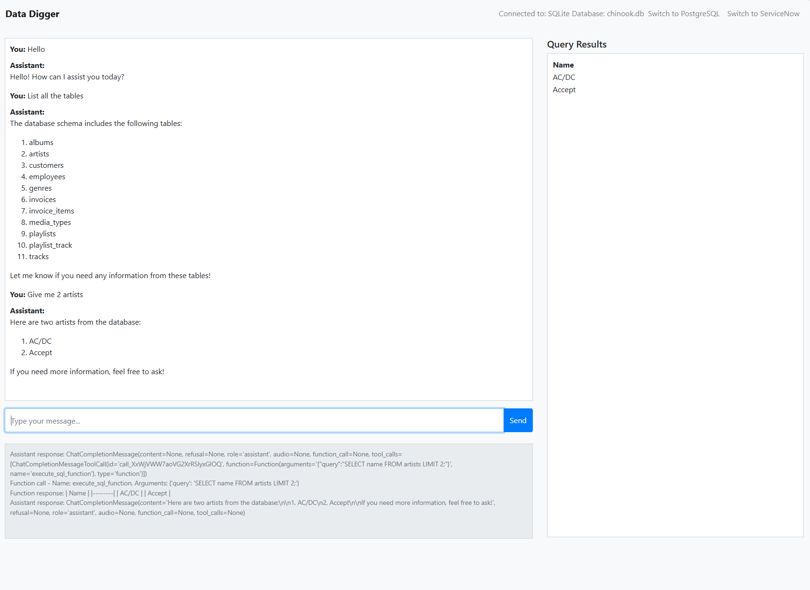

## Data Digger - A Database Assistant Agent

A conversational AI assistant that interacts with databases using natural language queries. This Flask application allows users to connect to various databases (SQLite, PostgreSQL, ServiceNow) and query them through a chat interface.


### Installation

**Clone the Repository**


```
git clone https://github.com/intel-sandbox/GenAI-Cookbook-Intel-Azure.git
cd database_assistant
```

**Create a Virtual Environment (Recommended)**


```
python -m venv venv
source venv/bin/activate  # On Windows, use 'venv\Scripts\activate'
```

**Install Dependencies**

```
pip install -r requirements.txt
```

### Configuration Setup


**Environment Variables**

Create a .env file in the root directory to store your environment variables. This file will hold sensitive information like API keys and database credentials.

**Note:** The app will work without setting env variables for the database conenctions, just the default sqlite.

**But you do need the openai config to be setup**

Setting Up the .env File


```
# .env

# OpenAI Configuration
OPENAI_API_KEY=your-api-key
OPENAI_API_HOST=your-api-host

# PostgreSQL Configuration
POSTGRESQL_HOST=your-db-host
POSTGRESQL_PORT=your-db-port
POSTGRESQL_DATABASE=your-db-name
POSTGRESQL_USER=your-db-port-user
POSTGRESQL_PASSWORD=your-db-pass
POSTGRESQL_SCHEMA=your-db-schema

# ServiceNow Configuration
SERVICENOW_API_BASE_URL=snow-base-url
SERVICENOW_USER=user
SERVICENOW_PASSWORD=pass

# export SQLITE_DB_PATH='/path/to/your/sqlite.db'
```

**Notes:**

Ensure your config.py file correctly loads the environment variables from .env:


### Running the Application


**Step 1: Set Up Environment Variables**

Ensure that your .env file is properly set up as described in the Configuration section. The application uses python-dotenv to load these variables.

**Step 2: Initialize the Application**

The application initializes with the default SQLite database specified in your .env file or config.py.

**Step 3: Start the Flask App**

Run the application using Flask's development server:
```
flask run
```

Or:
```
python app.py
```

**Step 4: Access the Application**

Open your web browser and navigate to:


http://localhost:5000/


### Usage


**Chat Interface**


- **Send Messages:** Type your queries in natural language into the input box and press Send.
- **Response:** The assistant will process your query and respond accordingly.
- **Results Pane:** Any query results will be displayed in the Execute Query Results pane on the right.

**Switching Databases**
- **Navigation Bar:** Use the Switch to links in the navigation bar to switch between databases.

#### Default DB connection on Startup
The current version of the app by default is connected to an sqlite db called [chinook.db](https://github.com/intel-sandbox/GenAI-Cookbook-Intel-Azure/blob/main/database_assistant/data/chinook.db), you can find the schema and more info on that db here: https://www.sqlitetutorial.net/sqlite-sample-database/

### Preview of the Application

Below is a screenshot of the application interface:




#### For more details:
Contact: atharva.patade@intel.com
